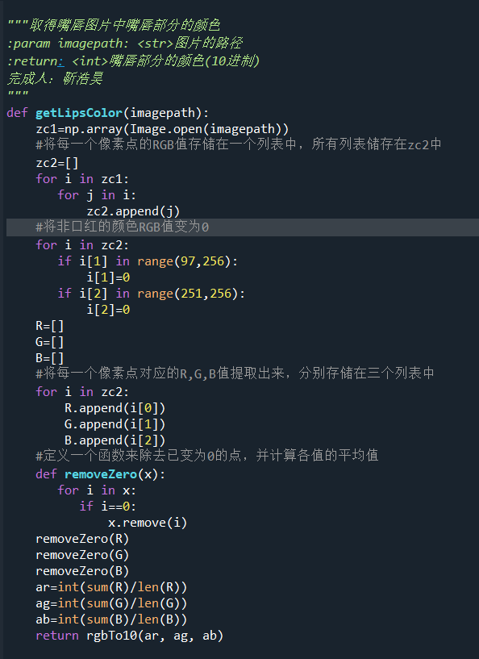
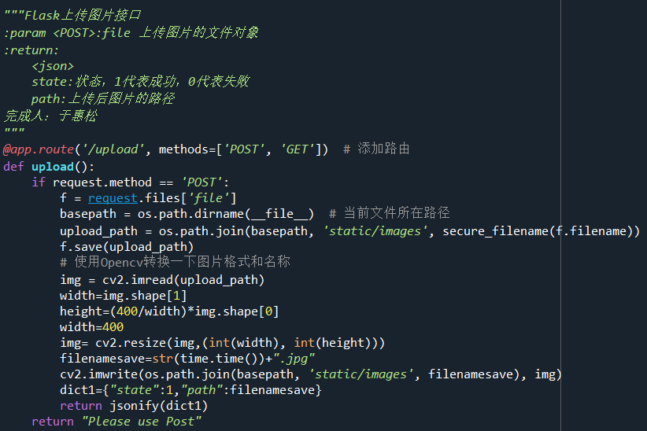
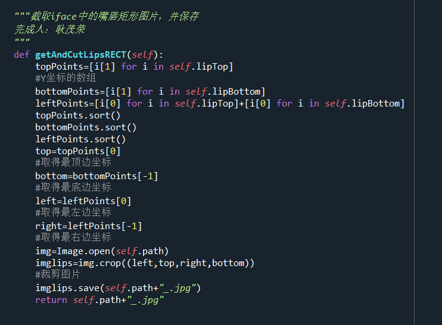
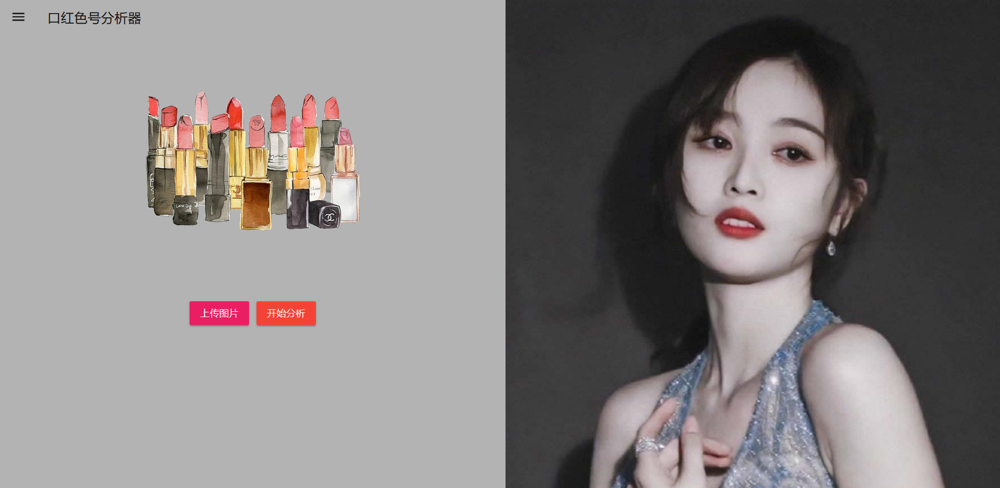
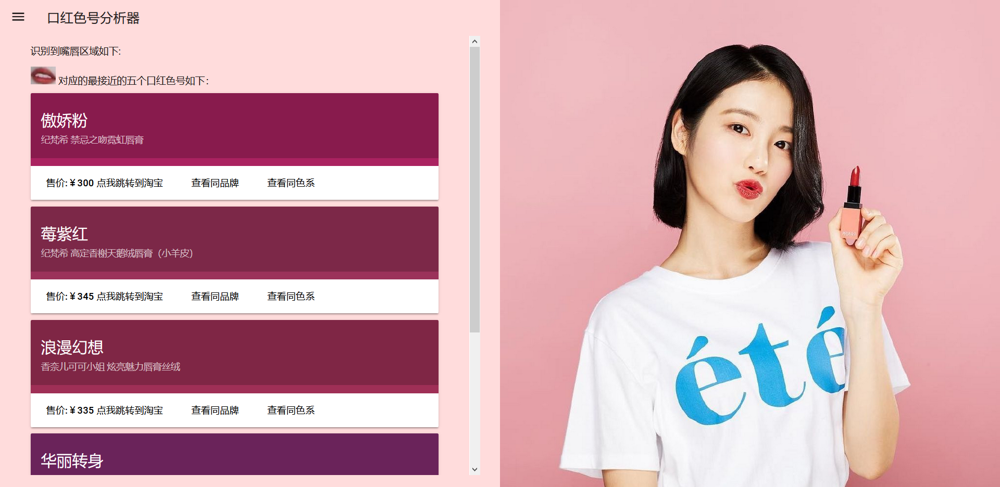
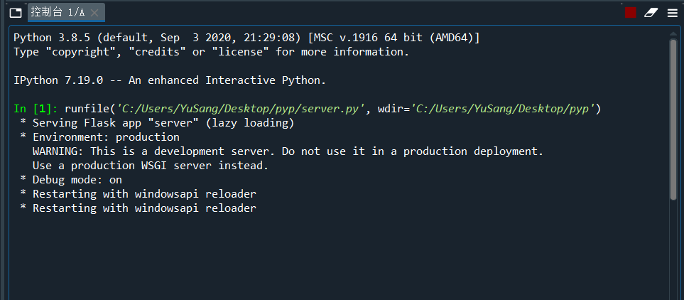

2020-2021学年第1学期

**《计算机科学与应用（Python）》课程项目报告**

| 学 生1   | 学号：*** 姓名：于惠松 |
|----------|----------------------------------|
| 学 生2   | 学号：*** 姓名：靳浩昊 |
| 学 生3   | 学号：*** 姓名：赵君夫 |
| 学 生4   | 学号：*** 姓名：耿茂荣 |
| 学 生5   | 学号： 姓名：                    |
| 指导教师 | 张华                             |
| 完成日期 | 2020 年 12月 27日                |

1.  **选题**

2.  程序名称：

>   **口红色号识别器**

1.  选题：

>   **基于图像处理、人脸识别和Flask构建的图片口红色号识别及商品推荐系统**

1.  功能：

>   **根据上传的图片自动化图像处理后分析脸部特征，并判断其嘴部妆容状态，依托现有大数据分析，识别其口红色号，并推荐相关商品，通过Flask服务器框架返回到网页前端并动态呈现**

1.  **需求分析**

-   *应用场景*

>   假设，圣诞前夕，*小姐姐*发来了一张美妆博主的美照，并暗示你，“人家也喜欢这个颜色。
>   ”

>   *这个时候，用我们的口红色号识别器，就能定位嘴唇，并迅速给出它的颜色隶属哪家品牌的哪个色号。*

-   *需求分析*

>   *现代社会，化妆是一样很常见且必要的技能，本程序可以依据现有的图片，提取其口红色号，匹配其化妆品的型号。*

1.  **设计**

>   **公开的后端接口：**

| **接口**        | **调用方式**                              | **返回值**                                                                                                 | **说明**                                                         |
|-----------------|-------------------------------------------|------------------------------------------------------------------------------------------------------------|------------------------------------------------------------------|
| **/upload**     | **[POST] \<str\>ImgData=图片二进制数据**  | **\<JSON\> Path: 上传完成后的在服务端的文件名**                                                            | **将图片上传到后端，保存为文件后返回**                           |
| **/getLip**     | **[POST] \<str\>Path=图片在服务端的路径** | **\<json\> state:状态，1代表成功，0代表失败fcolor:识别出来的嘴唇部分颜色 list:识别出来颜色对应口红的字典** | **获取已上传的某张图片的嘴唇部分的颜色并返回与其匹配的口红列表** |
| **/matchColor** | **[post] \<str\>Color=16进制颜色值**      | **\<json\> state:状态，1代表成功，0代表失败list:与该颜色接近的口红的列表**                                 | **根据给定的颜色值寻找在数据集中最相近的5款口红**                |

>   **内部模块接口**

| **接口**                            | **调用方式**                                | **返回值**                                 | **说明**                                           |
|-------------------------------------|---------------------------------------------|--------------------------------------------|----------------------------------------------------|
| **\@data. parseJSON**               | **初始化时自动调用**                        | **无**                                     | **将庞大的口红数据集转为python可以直接使用的list** |
| **\@data. getLipstickByID**         | **Args: \<str\>ID:口红编号**                | **\<Tuple\>**                              | **根据口红的编号取口红的数据**                     |
| **\@data. matchSimlarLipstick**     | **Args: \<int\>Color:10进制颜色值**         | **\<List\>**                               | **根据给定的颜色返回最接近的口红编号列表**         |
| **\@data. matchSameColor**          | **Args: \<int\>color:10进制颜色值**         | **\<tuple\>**                              | **返回与给定颜色同色系的口红列表**                 |
| **\@data. matchSameBrand**          | **Args: \<str\>brand;品牌**                 | **\<tuple\>**                              | **返回与给定品牌同品牌的口红列表**                 |
| **\@face.iface .init**              | **Args: \<str\>Imgpath:欲处理的图片文件名** | **\<None\>**                               | **初始化一个自己编写的iface对象**                  |
| **\@face.iface .hasFace**           | **直接调用，无参数**                        | **\<BOOL\> Ture/False**                    | **检测该对象的图片是否存在完整人脸**               |
| **\@face.iface .findLips**          | **直接调用，无参数**                        | **\<Tuple\> [0]:左顶点 [1]:宽度 [2]:高度** | **返回该对象图片中嘴唇所在的矩形区域**             |
| **\@face.iface .getAndCutLipsRECT** | **Args: None**                              | **None**                                   | **截取iface中的嘴唇矩形图片，并保存**              |
| **\@image. getLipsColor**           | **Args: \<str\>imagepath**                  | **None**                                   | **取得嘴唇图片中嘴唇部分的颜色**                   |
| **\@image. rgbTo10**                | **Args: \<int\>r,g,b**                      | **\<int\>**                                | **将一个RGB颜色值转化为10进制颜色值**              |
| **\@image. hexto10**                | **Args: \<str\>HEX**                        | **\<int\>**                                | **十六进制到10进制转换**                           |
| **\@image. getRGB**                 | **Args: \<int\>color**                      | **\<Turple\> [0]:R [1]:G [2]:B**           | **从一个十进制的颜色值转为R,G,B**                  |
| **\@image. getColorDistan ce**      | **Args: \<int\>Color1 \<int\>Color2**       | **\<int\>**                                | **取得两个颜色在LAB空间下的视差距离**              |

>   **项目文件结构：**

| 文件名             | 功能                                                                                                                             |
|--------------------|----------------------------------------------------------------------------------------------------------------------------------|
| /server.py         | 项目的主程序 **于惠松 负责** 接受和处理来自网页的请求 基于Flask                                                                  |
| /face.py           | 人脸识别模块 **耿茂荣 负责** 负责对已上传的图片进行人脸采集 并提取其特征点                                                       |
| /image.py          | 图像处理模块 **靳浩昊 负责** 负责对已采集好的特征点进行图像处理，通过算法提取其嘴唇颜色                                          |
| /data.py           | 数据处理模块 **赵君夫 负责** 负责对现有的包含各品牌口红的json数据进行分析处理                                                    |
| /data.json         | 来源于网络的 包含了口红色号及品牌名称的庞大数据集                                                                                |
| /static/ /temples/ | 静态网页资源 **于惠松 负责** 前端HTML5网页 UI基于 MDUI 前端框架构建 **交互由原生JavaScript的 FormData 和 XHR，实现异步AJAX请求** |

1.  **关键代码**

1.  **运行效果**

>   **运行方式：运行server.py 之后，在浏览器打开 http://127.0.0.1:8987/**

运行时总体没有出现大问题，但仍有部分图片识别错误，人脸特征点不对，或者把非人脸识别成人脸。

1.  **总结**

2.  对庞大数据集的处理

>   程序将口红数据储存在 lipstick.json
>   中，本程序遇到的难点在于如何把json数据集中庞大的数据转换为python中的列表，而且这个json数据采用了多重嵌套，本程序使用的解决方案是将lipstick.json一步一步解套然后加入到一个列表中。

>   [./media/image10.png](./media/image10.png)

1.  LAB颜色空间算法

>   事实上，人眼对颜色的识别有非常大的偏差，当两个颜色值相差一定值的时候，在不同分量上的相差往往表现的观感不同，比如在红色上相差一定值往往比在绿色上相差一定值要来得更明显，在这种情况下，常规取色差的方法就显得不那么靠谱。

>   于是我们最终选择了查阅资料找到的LAB颜色空间算法，这种算法将RGB颜色转换为LAB颜色，LAB颜色是以颜色在各个分量的比例确定的，更接近人眼的观感。

>   [./media/image11.png](./media/image11.png)

1.  Face\_recognition库

>   我们采用了face\_recognition
>   来识别人脸和处理脸部特征。但是在这个库安装的时候出现了许多问题，最后发现这个库需要一个前置库cmake，还要安装visual
>   studio 来编译这个库之后才能使用。

1.  程序处理时间的优化

>   在现代手机相机中，一张照片的尺寸是极大的，而在提取颜色的时候需要对所有的像素进行分析，这样的操作十分费时间。

>   举例说明，一个4000\*4000像素的照片其操作的时间复杂度是400\*400像素照片的100倍，因此，我们选择在上传前和后对图片进行压缩。

>   [./media/image12.png](./media/image12.png)

1.  **评语和成绩**

| 教师 评语 |         |         |         |         |         |
|-----------|---------|---------|---------|---------|---------|
| 成绩      | 学生1： | 学生2： | 学生3： | 学生4： | 学生5： |
